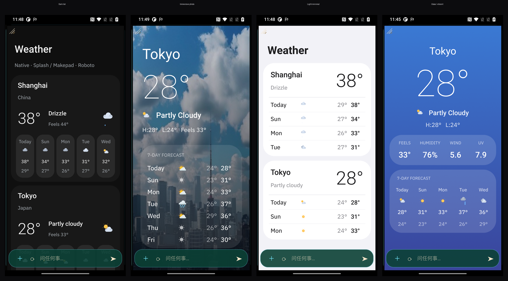

# Weather card — style choices

The weather app card supports **selectable visual styles**: the same live
`sys.weather` data, rendered in one of several distinct skins. A "style" is just
a preset of layout + tokens (colors, fonts, chrome) over the same data bindings —
so adding a style never touches the data path, and every style stays live and
auto-refreshing.

All four are native **Splash** cards (not WebView), proven on the OnePlus 6T, and
all use the bundled **Roboto** weights (Thin/Light/Medium/Bold) for the big
temperatures — see `docs/OCTOS-WIDGETS.md` / the font-loading note. Temps render
as **whole degrees** (the `sys.weather` helper rounds `*temperature*` paths;
wind/UV keep their precision).

## The catalog

| Style | File | Look | Best for |
|---|---|---|---|
| **Dark list** | `style-dark.splash` | Dark `#0f0f0f` cards, thin Roboto temps, multi-city, rounded day chips (hi/lo stacked). | A multi-city overview; matches the WebView card. |
| **Immersive photo** | `style-immersive.splash` | Full-bleed AI city photo (`sys.photo`) + scrim, one city, huge Roboto-Thin temp, frosted 7-day panel. | A single focused city; the "wow" default. |
| **Light minimal** | `style-light.splash` | Light `#f2f2f7` bg, white cards, dark text, hairline dividers, one accent. | Daytime / high-brightness; clean. |
| **Glass / vibrant** | `style-glass.splash` | Blue→indigo gradient sky, frosted translucent cards, current-stat grid (feels/humidity/wind/UV) + 7-day strip. | A single city, iOS-widget feel. |

## How a style is chosen

The weather agent picks the style per request; selection order:

1. **Explicit keyword in the request** (any language):
   `dark` / 深色 → dark · `minimal` / `light` / `clean` / 简约 → light ·
   `glass` / `vibrant` / `gradient` / 毛玻璃 → glass · `photo` / `immersive` → immersive.
2. **Stored preference** (optional): a `wx.style` key in the shell's
   `a2app_state`, if the product wants a persisted per-user default.
3. **Default**: `immersive` (single named city) — the richest look. (A bare
   `weather` with no city can default to `dark`'s multi-city overview instead.)

This is the same pattern as any app-card choice: the contract enumerates the
options, the agent selects one, the data bindings are identical across them.

## Wiring (contract)

`a2app/apps/weather/app.md` carries a **STYLE CHOICES** section: it lists the four
styles + the selection rule above, and references these four `.splash` files as
per-style exemplars. Each file is a single hardcoded demo (Shanghai/Tokyo/SF);
the agent adapts the **city name + real lat/lon** to the request (exactly as it
already does for the canonical exemplar) and keeps every temperature a
`sys.weather(...)` call.

To make the choices live on-device, rebuild + deploy the app memory:
`python3 scripts/build_memory.py` → push `MEMORY.md` to the profile (see
`docs/BUILDING-ANDROID.md`).

## Adding a new style

1. Author one `style-<name>.splash` (copy the closest existing one; keep every
   number a `sys.weather` binding).
2. Verify on device via `--es makepad.SEED_CARD_FILE /data/local/tmp/x.splash`
   (raw DSL → auto-wrapped in `runsplash`; no APK rebuild needed).
3. Add a row to the catalog table + a keyword to the selection rule in `app.md`.
